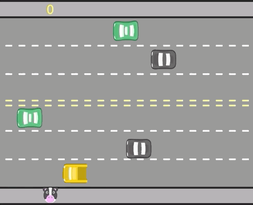

## 💻 Sobre este curso

(..) concluiu o curso online "Lógica de programação: laços e listas com JavaScript" de carga horária estimada em 4 horas, realizando 33 de 33 atividades, no período de 06/04/2023 a 06/04/2023.

Este curso abordou os seguintes tópicos:

1. Iniciando o projeto
2. Dividindo o código e carros para sempre
3. Listas e laços de repetição
4. Colisão, + carros e pontos
5. Adicionando sons e pontos negativos

------
## 📰 <a href="https://unibb.alura.com.br/certificate/b01770bb-6008-4848-b25c-4f59653e0be5">Certificado de conclusão do curso</a>

