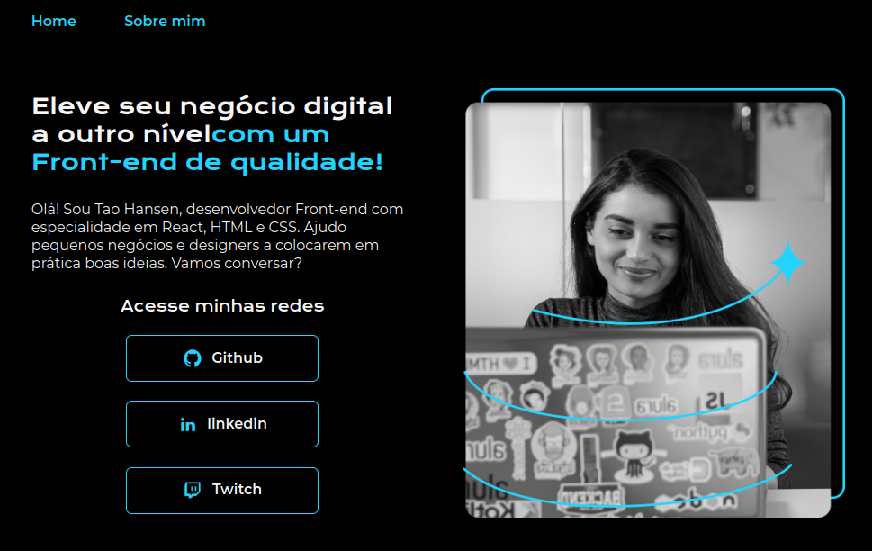

## 💻 Sobre estes cursos

Imagem do projeto

### Trilha de HTML+CSS (4 cursos)

##### HTML e CSS: ambientes de desenvolvimento, estrutura de arquivos e tags

Este curso abordou os seguintes tópicos:

1. O editor de código VSCode
2. Documentação e HTML
3. Layout e tags semânticas
4. Estilizando o projeto com CSS
5. Super estilizando o seu CSS

 📰 <a href="https://unibb.alura.com.br/certificate/f6d8a546-b2d4-4731-8476-f480828aa8dd">Certificado de conclusão do curso</a>

------

##### HTML e CSS: Classes, posicionamento e Flexbox

1. Seletores e posicionamento
2. Posicionando mais elementos
3. Estilos de texto e fontes
4. Manipulando botões
5. Ajustando o espaçamento

📰 <a href="https://unibb.alura.com.br/certificate/11a95227-edcf-4143-8d42-09aab77b5e32">Certificado de conclusão do curso</a>

------

##### HTML e CSS: cabeçalho, footer e variáveis CSS

1. Preparando o layout do projeto
2. Criando ícones clicáveis
3. Criando header e footer
4. Navegando entre páginas
5. Aplicando variáveis CSS

📰 <a href="https://unibb.alura.com.br/certificate/a388210c-f829-4385-987e-3fd40d6447db">Certificado de conclusão do curso</a>

------

##### HTML e CSS: trabalhando com responsividade e publicação de projetos

1. Unidade de medidas
2. Adaptando elementos
3. Responsividade
4. Responsividade e GitHub
5. Repositório do GitHub

📰 <a href="https://unibb.alura.com.br/certificate/b0d764b4-99a6-4116-8880-9458ad6f7712">Certificado de conclusão do curso</a>

------

