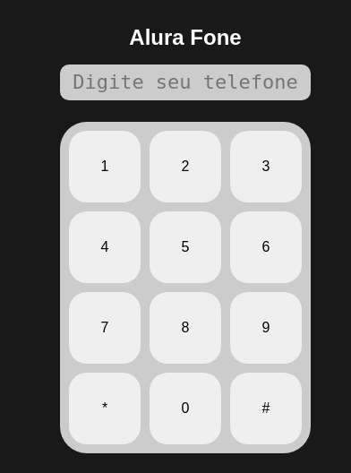

## 💻 Sobre este curso

### Projeto Principal: 

"Bateria" manipulada por Javascript, ao clicar na tecla, ou teclar
'enter', ou 'espaço' emite o respectivo áudio.

(..) concluiu com aproveitamento o curso online "JavaScript para Web: Crie páginas dinâmicas" de carga horária 
estimada em 10 horas, realizando 46 de 46 atividades.

Este curso abordou os seguintes tópicos:

1. Conhecendo o JavaScript
2. Funções
3. Listas
4. Iterando em listas
5. Eventos e lógicas

------
## 📰 <a href="https://unibb.alura.com.br/certificate/c2319ed1-f68f-4b18-b163-5847defad934">Certificado de conclusão do curso</a>

------

 

##### Projeto Auxiliar - AluraFone (input com Js)

