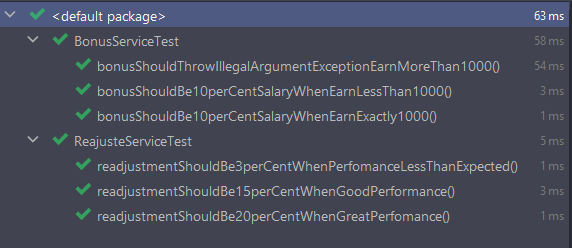

## 💻 Sobre este curso

##### TDD e Java: testes automatizados com JUnit

Este curso abordou os seguintes tópicos:

1. Testes automatizados
2. JUnit
3. TDD: Test-Driven Development
4. Lidando com exceptions
5. Mais recursos

 📰 <a href="https://unibb.alura.com.br/certificate/a40061df-a79f-4a0e-b393-b9974306c6a3">Certificado de conclusão do curso</a>

------
